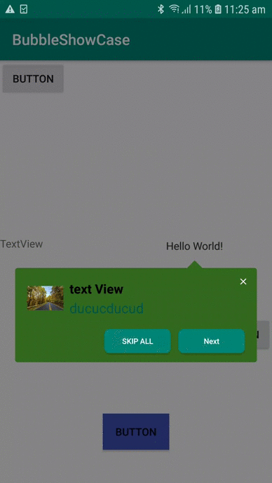

# BubbleShowCase
=================


[](https://opensource.org/licenses/Apache-2.0)
[](http://developer.android.com/index.html)
[](https://android-arsenal.com/api?level=19)
<br>
BubbleShowCase is an elegant and simple framework developed in Kotlin (usable also in Java) that let you to use informative bubbles to help your users pointing out different features of your application or in your App onboarding. The basic use of the framework consists on a target element passed as input which will be highlighted over a translucent background and pointed out by a customizable bubble.



## Getting started

Add the library into your proyect is really easy, you just need to add this line in dependencies block in your app Gradle:
```groovy
	        implementation 'com.github.mohamedmabrouk582:BubbleShowCase:LATEST_VERSION'
```
**NOTE:** You can check the LATEST_VERSION in the version badge at the top of this file.

#simple
               
	        BubbleShowCaseBuilder(this)
                .title(it.title) 
                .description(it.content)
                .titleColor(Color.parseColor("#000000"))
                .contentColor(Color.parseColor("#00574B"))
                .backgroundColorResourceId(R.drawable.backGround)
                .titleTextSize(17)
                .descriptionTextSize(18)
                .showNextButton(true) 
                .nextButtonText("Next")
                .nextButtonColorResourceId(R.color.white)
                .nextButtonTextSize(10f)
                .showSkip(true)
                .skipTextSize(10f)
                .skipResourceId(R.drawable.next_btn)
                .skipText("Skip All")
                .skipTextColorResourceId(R.color.white)
                .nextButtonResourceId(R.drawable.next_btn)
                .showOnce(it.key)
                .closeActionImageResourceId(R.drawable.ic_close_black_24dp)
                .imageResourceId(R.drawable.download__1_)
                .highlightMode(BubbleShowCase.HighlightMode.VIEW_SURFACE)
                .listener(object : BubbleShowCaseListener {
                    override fun onTargetClick(bubbleShowCase: BubbleShowCase) {

                    }

                    override fun onCloseActionImageClick(bubbleShowCase: BubbleShowCase) {

                    }

                    override fun onBackgroundDimClick(bubbleShowCase: BubbleShowCase) {

                    }

                    override fun onBubbleClick(bubbleShowCase: BubbleShowCase) {

                    }

                }).targetView(it.view).show
